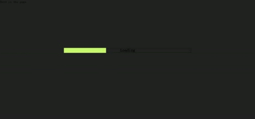

# splash-screen  #
=============

A simple splash screen




## Install ##

```powershell
bower install --save splash-screen
```

## Usage ##

```html
<link rel="stylesheet" type="text/css" href="splash.min.css">
<script type="text/javascript" src="splash.min.js"></script>
```

```javascript
Splash.enable(); //launch the splash-screen while needed

Splash.destroy();//destroy the splash-screen on demand
```


## LICENSE ##

[MIT License](https://raw.githubusercontent.com/leftstick/splash-screen/master/LICENSE)